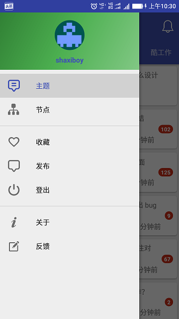
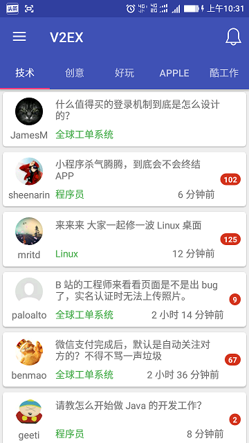
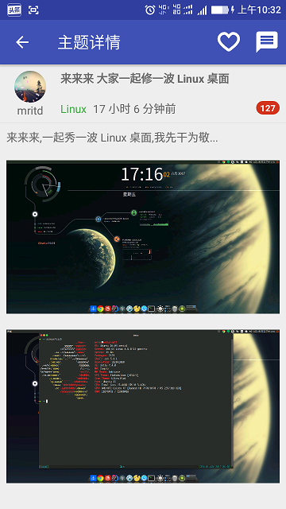
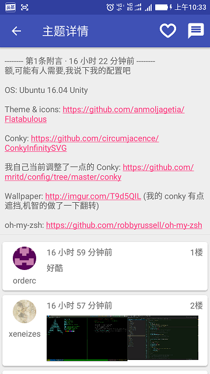
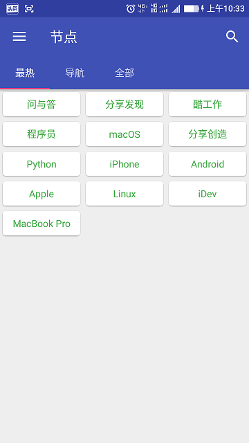
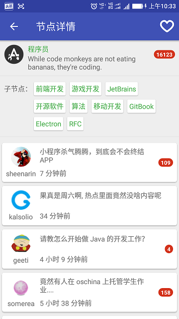
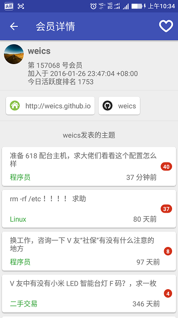
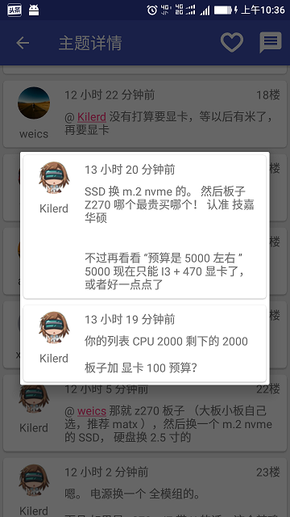

# V2EX
V2EX网站第三方安卓客户端

目前实现了以下基本功能，后续会继续完善优化。
1.	查看网站首页主题列表。
2.	查看主题详情及其回复（可查看@用户在本主题下发表的回复，极大地方便了回复的浏览）。
3.	查看最热节点、节点导航和全部节点，搜索节点，查看父节点、子节点和相关节点，查看节点主题列表。
4.	查看用户基本信息、用户发表的主题和回复。
5.	登陆和登出，登陆用户可回复主题，发表新主题，收藏主题、节点和用户，查看提醒信息。

项目开发过程中参考学习了以下两个项目：[https://github.com/greatyao/v2ex-android](https://github.com/greatyao/v2ex-android)，[https://github.com/CzBiX/v2ex-android](https://github.com/CzBiX/v2ex-android)，在此对这两位开发者表示感谢！

通过模拟网站HTTP请求获取数据。

主要使用了以下开源库：jsoup、Retrofit2、FlexibleAdapter、Glide、Butter Knife、EventBus。

使用腾讯Bugly实现App异常上报和应用更新功能。

针对App使用反馈功能开发了后台服务，该服务使用JFinal极速开发框架开发， 数据存储使用SQLite。

